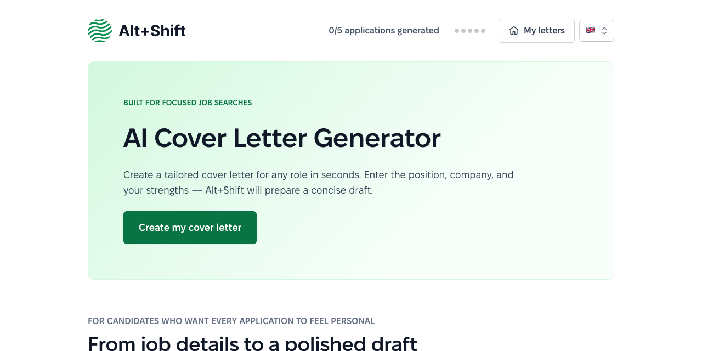

<p align="center">
  
</p>

# Alt+Shift

[](https://github.com/greenhost87/alt-shift/actions/workflows/ci.yml)  

A responsive, local-first cover-letter generator. Create a tailored letter for each role, keep completed applications close, and stay in control of your data.

- Stream personalized cover letters as they generate.
- Save completed letters in versioned browser storage and sync them across tabs.
- Keep the generation API token server-side, with abuse limits enforced by the server.

## Stack

- React 19 and TypeScript
- TanStack Start and TanStack Router
- Vite 8
- Reshaped with a custom theme and CSS Modules
- Valibot for runtime validation
- Bun as the runtime and package manager
- Playwright for browser tests

## Requirements

- [Bun](https://bun.sh/) 1.4.2 or newer

## Local development

Install dependencies:

```bash
bun install
```

Create the local environment file, set the server-only API token, and generate a session secret:

```bash
cp .env.example .env
openssl rand -hex 32
```

Set the printed value as `SESSION_SECRET` in `.env`. Generation provider settings, field limits, product goals, initial content, and browser storage identifiers are documented in `.env.example`. `GENERATION_API_TOKEN` and `SESSION_SECRET` are the required values without defaults. Fresh browser storage starts with an empty application list and an empty generator form; the initial-content variables can provide explicit seed data when needed.

Start the development server:

```bash
bun run dev
```

Vite prints the local HTTPS URL after startup, usually `https://localhost:5173`. HTTPS is required for browser APIs such as clipboard access.

To test from a phone on the same network, expose the development server:

```bash
bun run dev -- --host 0.0.0.0
```

Open the printed network URL with `https://` and accept the development certificate warning once. Do not use the corresponding `http://` URL because Chrome disables clipboard access on insecure network origins.

Create a production build:

```bash
bun run build
```

## Commands

| Command               | Purpose                                                     |
| --------------------- | ----------------------------------------------------------- |
| `bun run dev`         | Build the Reshaped theme and start Vite in development mode |
| `bun run build`       | Build the theme and production application                  |
| `bun run theme:build` | Generate the custom Reshaped theme                          |
| `bun run fmt`         | Format the repository with oxfmt                            |
| `bun test`            | Run Bun tests                                               |
| `bun run test:e2e`    | Run Playwright tests                                        |

## Deployment

GitHub Actions runs frozen installation, formatting, type checks, unit tests, the production build, and Playwright on every pull request and push to `main`. A push to `main` also builds `alt-shift.tar.gz` and deploys it to a systemd service with an atomic release swap, `/api/health` verification, and rollback on failure.

Configure these repository secrets: `SERVER_HOST`, `SERVER_USERNAME`, `SERVER_SSH_PORT`, `APP_PORT`, `BASE_PATH`, `PUBLIC_SITE_URL`, and `PROD_SERVER_SSH_KEY`. Set `BASE_PATH` to the URL prefix, for example `/alt-shift`, and set `PUBLIC_SITE_URL` to the complete public URL with the same prefix. The SSH user must run as root because deployment manages systemd and `/opt/data` paths. Install Bun, `curl`, and `ss` on the server, then create `/opt/data/config/alt-shift.env` from [the production environment template](.github/workflows/scripts/production.env.example). Keep `SQLITE_PATH` outside `/opt/data/alt-shift` so database state survives release swaps.

## Server architecture

The production server is a single Bun process (`src/server.ts`): it serves the built client assets, runs TanStack Start server functions and routes, and proxies generation to the paid upstream API so the API token never reaches the browser. There is no separate database server; all server state lives in one SQLite file.

### SQLite and migrations

- The database path comes from `SQLITE_PATH` (default `data/app.sqlite`, resolved against the working directory). The server creates missing parent directories, enables `foreign_keys`, a 5&nbsp;s `busy_timeout`, and WAL mode for file databases.
- `src/server/database/connection.ts` keeps a single shared `bun:sqlite` connection per process (test hooks can swap it via `installDatabaseForTests`).
- `migrations/*.sql` run automatically at startup through `runDatabaseMigrations`, tracked in a `schema_migrations` ledger inside one immediate transaction. Three migrations exist: `001_generation_rate_limit` (request log), `002_anonymous_sessions` (sessions), `003_application_generation_limit` (per-session generation slots).
- Keep `SQLITE_PATH` outside the release directory (production uses `/opt/data/alt-shift-data/app.sqlite`) so rate-limit history, sessions, and generation slots survive atomic release swaps.

### Anonymous sessions

- `handleSessionSecurity` (`src/server/security/session.ts`) wraps every request. Browsers get a signed `ALT_SHIFT_SESSION` id cookie and an `ALT_SHIFT_CSRF` cookie; only the SHA-256 hash of the CSRF token is stored in `anonymous_sessions`, with expiry from `SESSION_TTL_MS` (default 7 days).
- Safe methods pass through; mutations require the `x-csrf-token` header to match the stored hash and the request origin to match `PUBLIC_SITE_URL`. Verified requests carry `x-alt-shift-verified-session` internally.

### Device fingerprinting and rate limiting

- Each request is fingerprinted with HMAC-SHA-256 (`SESSION_SECRET` as key) over the User-Agent family headers, `accept-language`, and the client's `x-client-device-signals` value (`src/server/generation/client-fingerprint.ts`). The fingerprint keys the rate limiter; it cannot be reversed into client data without the secret.
- `POST /api/generate` enforces, in order: client-signal validation, a sliding-window rate limit (`GENERATION_RATE_LIMIT`, default 6, per `GENERATION_RATE_WINDOW_MS`, default 60&nbsp;s) plus a global limit across fingerprints (`GENERATION_GLOBAL_RATE_LIMIT`, default = per-client limit), then the per-session application cap (`APPLICATION_LIMIT`, default 5) via a reserved slot in `application_generation_slots`. The slot is released when generation fails, so failed attempts do not consume the cap.
- Limited requests return `429` with a `retry-after` hint (`rate_limited`); a full cap returns `application_limit_reached`. Both are SQLite-backed, so limits survive restarts but are per-server (no sharing between replicas).

### Required secrets

- `SESSION_SECRET` (minimum 32 characters) signs session ids and fingerprints; the server refuses to boot without it.
- `GENERATION_API_TOKEN` authenticates upstream calls; it is only ever read server-side (`src/server/generation/config.ts`).
- See `.github/workflows/scripts/production.env.example` for the full production variable list; the live values live in `/opt/data/config/alt-shift.env`, readable only by the deploy user.

### Startup behavior and operations

- Boot order: `startInstance` options → `SESSION_SECRET` validation (fail fast) → pending SQLite migrations → request handling. Static assets are served directly with immutable caching for `/assets/*`; everything else goes through session security and the app handler with a shared database connection.
- Deployment (`.github/workflows/deploy.yml`) builds `alt-shift.tar.gz`, swaps the release atomically under `/opt/data/alt-shift`, and verifies `/api/health` with rollback on failure. Deploys run only after the `CI` workflow (format, types, unit tests, build, full E2E) succeeds on `main` — via `workflow_run`, deploying the exact verified commit (`head_sha`); manual `workflow_dispatch` stays available for exceptional reruns.

### Rationale for the server-side limit and fingerprinting (retained)

- The stateful application cap (`APPLICATION_LIMIT`, 5) and device fingerprinting are kept deliberately for this assignment: every generation calls a paid upstream LLM API, so an unenforced client-side counter would let anyone burn budget by clearing storage; fingerprinting (HMAC with `SESSION_SECRET`, no reversible client data) makes the per-client rate limit robust against trivial bypass while staying anonymous — no accounts, no PII at rest.
- Maintenance cost, accepted: single stateful node (SQLite + WAL sidecars backed up together; no limit sharing between replicas), `SESSION_SECRET` rotation invalidates all sessions and fingerprints, and deleting the database resets every cap. Revisit if the app ever scales past one box or gains real accounts.
- Operational implications: one stateful box (SQLite + WAL sidecars must be backed up together); deleting the database resets all rate limits, sessions, and generation caps; rotating `SESSION_SECRET` invalidates every session and changes all fingerprints; the client keeps its own `localStorage` letters and count cookie, so wiping server state does not delete saved letters but does reopen the generation cap.

## Troubleshooting

The reported `reportAllChanges` signature does not occur in the application source or dependency lockfile. A source named `VM…` with only `<anonymous>` frames indicates runtime-generated code and is consistent with externally injected page code, but this repository cannot identify the injector. Reproduce the error in a fresh browser profile or a private window with extensions disabled, then check extensions, DevTools add-ons, and other browser-side page instrumentation. The Playwright navigation suite checks the application's core routes for uncaught page errors in a clean browser context.

## Project structure

```text
src/
├── components/
│   ├── features/    # Dashboard and application generator
│   ├── layout/      # Shell, workspace, grid, and section layouts
│   └── ui/          # Reusable buttons, fields, progress, and banner
├── routes/          # TanStack file-based routes
├── server/          # Server-only configuration utilities
├── styles/          # Global styles and self-hosted font declarations
├── system/theme/    # Theme source tokens
└── themes/variant/  # Generated Reshaped theme
```

## Generation API specification drift

Testing the live Generation API revealed these differences from its published specification:

- A successful stream starts with the SSE comment `: keepalive`, which is not shown in the documented response format.
- After the last `delta`, the service emits an unnamed SSE event with `data: [DONE]` before closing the connection. The specification says there is no separate completion event.
- The service accepted both an unknown JSON field and `maxTokens: 1501`. The latter only proves that an over-limit value is not rejected; a short response cannot establish whether the service still clamps generated output to 1,500 tokens.

The integration remains deliberately strict when sending requests: it emits only `system`, `prompt`, and `maxTokens`, with a default of 1,500 tokens. Its SSE parser processes only named `delta` events, so it safely ignores both the keepalive comment and the undocumented `[DONE]` event while still requiring the stream to close cleanly.

## Product direction

The application:

- generates cover letters through a streaming Generation API;
- keeps the API token on the server behind a same-origin endpoint;
- persists completed letters in versioned, validated `localStorage` data;
- restores saved letters after a reload and synchronizes browser tabs;
- tracks progress toward five completed applications;
- preserves partial output on generation failures so it can still be copied.

The five-application cap is a cost control, not just a progress goal: every generated letter calls the paid generation API, so anonymous usage must stay bounded for the product to earn money instead of giving inference away for free. The same number doubles as the progress goal shown in the header and dashboard. Enforcement has two layers: the client blocks further creation and shows the subscription upsell once the cap is reached, while the server independently limits completed applications per device (application limiter with device fingerprint) and rate-limits generation, so the cap survives cleared browser storage. Tune the cap with `APPLICATION_LIMIT` (default `5`); per-minute abuse is bounded separately by `GENERATION_RATE_LIMIT` and `GENERATION_GLOBAL_RATE_LIMIT`.

## AI-assisted workflow

AI tooling was used to inspect the repository, compare recurring UI patterns, scaffold focused components, and review implementation constraints. Visual details, component boundaries, responsive behavior, and server/browser security boundaries remained explicit engineering decisions rather than generated defaults.

Three decisions were kept deliberately narrow during that process:

1. Reuse Reshaped primitives and a project theme instead of introducing Tailwind or duplicating a second design system.
2. Keep application, generation, dashboard, and persistence state in an SSR-scoped Zustand store with selector-based subscriptions.
3. Proxy generation through server code instead of exposing the API token in the browser or replacing the required provider with another model API.

The most project-specific work is the theme and layout system: Fixel typography, reusable design tokens, responsive workspace composition, and the animated generation waiting state are implemented as a coherent product layer rather than page-specific styling.
